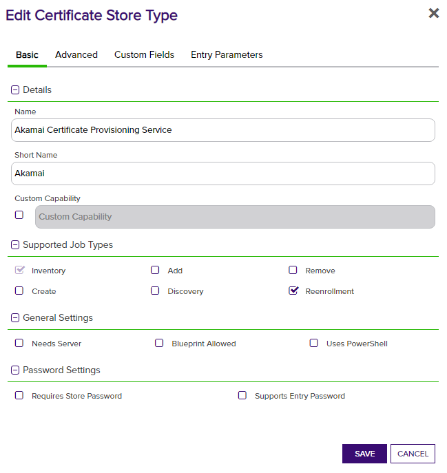
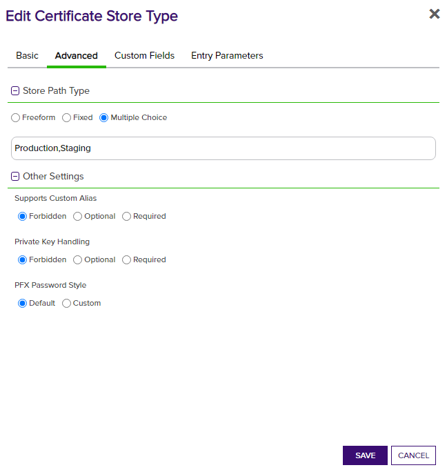

<h1 align="center" style="border-bottom: none">
    Akamai Certificate Provisioning System (CPS) Universal Orchestrator Extension
</h1>

<p align="center">
  <!-- Badges -->

<a href="https://github.com/Keyfactor/akamai-cps-orchestrator/releases"></a>


</p>

<p align="center">
  <!-- TOC -->
  <a href="#support">
    <b>Support</b>
  </a>
  ·
  <a href="#installation">
    <b>Installation</b>
  </a>
  ·
  <a href="#license">
    <b>License</b>
  </a>
  ·
  <a href="https://github.com/orgs/Keyfactor/repositories?q=orchestrator">
    <b>Related Integrations</b>
  </a>
</p>


## Overview

The Akamai Certificate Provisioning System (CPS) Universal Orchestrator extension is designed to facilitate the management of SSL/TLS certificates on the Akamai platform through Keyfactor Command. Akamai CPS allows users to provision, manage, and deploy SSL/TLS certificates across Akamai's global content delivery network (CDN). This ensures secure and reliable communication for websites and applications by enabling HTTPS.

The orchestrator extension operates using the concept of Certificate Stores. A Certificate Store represents a collection or individual instance of certificates in the Akamai system. These stores can be configured for different environments, such as 'Production' or 'Staging', to better manage the deployment lifecycle of certificates. By utilizing the Akamai CPS Universal Orchestrator extension, administrators can automate inventory, addition, removal, and discovery of certificates, streamlining certificate lifecycle management within the Keyfactor Command platform.

## Compatibility

This integration is compatible with Keyfactor Universal Orchestrator version  and later.

## Support
The Akamai Certificate Provisioning System (CPS) Universal Orchestrator extension is supported by Keyfactor for Keyfactor customers. If you have a support issue, please open a support ticket with your Keyfactor representative. If you have a support issue, please open a support ticket via the Keyfactor Support Portal at https://support.keyfactor.com. 
 
> To report a problem or suggest a new feature, use the **[Issues](../../issues)** tab. If you want to contribute actual bug fixes or proposed enhancements, use the **[Pull requests](../../pulls)** tab.

## Installation
Before installing the Akamai Certificate Provisioning System (CPS) Universal Orchestrator extension, it's recommended to install [kfutil](https://github.com/Keyfactor/kfutil). Kfutil is a command-line tool that simplifies the process of creating store types, installing extensions, and instantiating certificate stores in Keyfactor Command.


1. Follow the [requirements section](docs/akamai.md#requirements) to configure a Service Account and grant necessary API permissions.

    <details><summary>Requirements</summary>

    ### Akamai Platform Configuration

    In the Akamai instance, an API Credential needs to be configured and used to provide authentication for the Keyfactor Orchestrator extension to function. To do this, navigate to `Account Admin` -> `Identity & access`. Clicking `Create API client`, select a user whose permissions should be used to access and manage certificates. This user should already have the needed permissions to access CPS. The access of the API Client can be restricted to just the CPS APIs, but the API Client should have `READ-WRITE` access.

    With the API Client created, a new credential should be generated by clicking `Create credential`. The contents of the credential should be downloaded or saved temporarily to use for configuring the Keyfactor Certificate Store. Afterwards, it should be deleted as the credential file serves as authentication for accessing APIs, and should be treated as a plaintext password and not saved long-term.

    ### Akamai Orchestrator Extension Configuration

    **1a. Use `kfutil` to create the entire store type definition**

    Using `kfutil` to create the store type is the preferred method to create the Akamai store type. It will create all of the needed Custom Fields and Entry parameters (of which there are many).

    Creating the store can be done by running the following `kfutil` command:

    ```
    kfutil store-types create -n Akamai
    ```

    If using `kfutil`, skip steps __1b__ and __2__ and go to step __3__ to set the default values of the Entry Parameters.

    **1b. Manually Create the New Certificate Store Type for the Akamai orchestrator extension**

    In Keyfactor Command create a new Certificate Store Type similar to the one below by clicking Settings (the gear icon in the top right) => Certificate Store Types => Add:

    
    

    Custom fields and entry parameters will be added after the store is created. This is required as there are many entry parameters.

    **2. Add Custom Fields and Entry Paramaters**

    _Only requried if manually adding the certificate store._
    To add the needed Custom Fields and Entry Parameters, [run the script](akamai-cps-orchestrator/jobproperties.sql) on the Keyfactor database to generate all the fields and parameters needed.

    **3. Set default values of Entry Parameters**

    The Entry Parameters are used during Enrollment creation in Akamai CPS to provide contact information and associate new certificates with the correct Contract in Akamai. After adding the parameters, re-open the Certificate Store Type configuration and set the default values.

    The Contract ID should be set to the default contract to be used for new Enrollments. All of the address information should be filled out with default expected values, as they are required fields for **each** enrollment created and should not be entered manually unless they need to be overwritten for a specific Enrollment in Akamai.
    The Tech contact information should be your Akamai company contact, and needs to have an Akamai email address and should have Akamai as the organization name.

    **4. Create a new Akamai Certificate Store**

    After the Certificate Store Type has been configured, a new Akamai Certificate Store can be created. When creating the store, the credentials generated in the Akamai platform for the API Client will be used.

    | Certificate Store parameter | Akamai credential value |
    |-|-|
    | Client Machine | `host` |
    | Access Token | `access_token` |
    | Client Token | `client_token` |
    | Client Secret | `client_secret` |

    **5. (Optional) Enroll a new certificate in Akamai**

    Adding new certificates to Akamai requires generating a key in Akamai CPS via the Reenrollment process in Keyfactor. To start this process, go to the Certificate Store that the certicate should be added to. Select the certificate store, and click the `Reenrollment` button to bring up the reenrollment dialog.

    Change any default values as needed, and enter an Enrollment ID if an existing enrollment needs to be updated instead of creating a new Enrollment. This is different from the Slot ID - the Enrollment ID is found by clicking on an Active certificate in Akamai CPS, and looking at the `ID` value.
    The SAN entry needs to be filled out with the DNS value you are using for the certificate's CN. If there are multiple DNS SANs, they should be separted with an ampersand. Example: `www.example01.com&www.example02.com`


    **6. (Optional) Configure Renewal of Certificates using Expiration Alert Handler**

    Akamai does not support traditional certificate Renewal or one-click Renewal done in the Keyfactor Command platform. The Renewal process creates Certificates with outside keys which are not allowed to be imported into Akamai CPS. As a result, the Reenrollment Job must be used in order to renew existing certificates that reside on the Akamai system. Reenrollment is required as opposed to the Renewal process as it allows Akamai to generate the keys on their platform, which are used to create a certificate in Keyfactor.

    Renewing existing certificates in Akamai means running a Reenrollment Job with the same Enrollment ID that was used for an existing Certificate Enrollment. This can be done manually through the Reenrollment process, but an automated process can also be configured using a Keyfactor Expiration Alert Handler.

    The Expiration Alert Handler should be configured to target a Keyfactor Collection of certificates that includes the Akamai certificates that need to be renewed. This can be done with a query targeting the `CertStoreFQDN` containing `Akamai` and can be further restricted with the `CertStorePath` being equal to `Production` or `Staging`.

    With the Expiration Alert Handler using the correct Collection, the Alert should be set to use the `ExpirationPowershell` Handler. A [sample Powershell Handler script](./akamai-cps-orchestrator/AkamaiExpirationHandler.ps1) is included in this repository. The sample script needs to be updated with the correct URL for API requests, and may need other changes as well, as it assumes that Default Credentials (Windows Auth) can be used to authenticate API requests to the Keyfactor instance. __This script needs to be placed in the Keyfactor Command installation's configured Extension Handler Path (default: {installation_dir}\ExtensionLibrary) location so that it can be run.__

    The `ExpirationPowershell` Event Handler configuration should be configured with the following values:

    | Parameter Name | Type | Value |
    | - | - | - |
    | Thumbprint | Special Text | Thumbprint |
    | Template | Renewal Template | `desired renewal template` |
    | CAConfiguration | Renewal Certificate Authority | `desired renewal CA` |
    | ScriptName | PowerShell Script Name | AkamaiExpirationHandler.ps1 |

    When running the sample script, it will assume that all certs passed to the script should schedule a Reenrollment job with their existing parameters in Akamai.


    </details>

2. Create Certificate Store Types for the Akamai Certificate Provisioning System (CPS) Orchestrator extension. 

    * **Using kfutil**:

        ```shell
        # Akamai Certificate Provisioning Service
        kfutil store-types create Akamai
        ```

    * **Manually**:
        * [Akamai Certificate Provisioning Service](docs/akamai.md#certificate-store-type-configuration)

3. Install the Akamai Certificate Provisioning System (CPS) Universal Orchestrator extension.
    
    * **Using kfutil**: On the server that that hosts the Universal Orchestrator, run the following command:

        ```shell
        # Windows Server
        kfutil orchestrator extension -e akamai-cps-orchestrator@latest --out "C:\Program Files\Keyfactor\Keyfactor Orchestrator\extensions"

        # Linux
        kfutil orchestrator extension -e akamai-cps-orchestrator@latest --out "/opt/keyfactor/orchestrator/extensions"
        ```

    * **Manually**: Follow the [official Command documentation](https://software.keyfactor.com/Core-OnPrem/Current/Content/InstallingAgents/NetCoreOrchestrator/CustomExtensions.htm?Highlight=extensions) to install the latest [Akamai Certificate Provisioning System (CPS) Universal Orchestrator extension](https://github.com/Keyfactor/akamai-cps-orchestrator/releases/latest).

4. Create new certificate stores in Keyfactor Command for the Sample Universal Orchestrator extension.

    * [Akamai Certificate Provisioning Service](docs/akamai.md#certificate-store-configuration)


## License

Apache License 2.0, see [LICENSE](LICENSE).

## Related Integrations

See all [Keyfactor Universal Orchestrator extensions](https://github.com/orgs/Keyfactor/repositories?q=orchestrator).