<h1 align="center" style="border-bottom: none">
    Akamai Certificate Provisioning System (CPS) Universal Orchestrator Extension
</h1>

<p align="center">
  <!-- Badges -->

<a href="https://github.com/Keyfactor/akamai-cps-orchestrator/releases"></a>


</p>

<p align="center">
  <!-- TOC -->
  <a href="#support">
    <b>Support</b>
  </a>
  ·
  <a href="#installation">
    <b>Installation</b>
  </a>
  ·
  <a href="#license">
    <b>License</b>
  </a>
  ·
  <a href="https://github.com/orgs/Keyfactor/repositories?q=orchestrator">
    <b>Related Integrations</b>
  </a>
</p>

## Overview

Akamai Certificate Provisioning Service (CPS) provides certificate management and administration for certificates that 
are used within Akamai systems. This orchestrator interacts with Akamai CPS in order to Inventory certificates currently 
defined in that platform, and also supports adding new certificates or renewing existing ones.
New certificates are created in Akamai CPS via On Device Key Generation (ODKG aka Reenrollment). This means that 
certificates cannot be directly added to the CPS system, but instead need to have their keys generated in Akamai and 
then have a certificate issued for that keypair via a CSR.
This workflow is completely automated in the Akamai CPS Orchestrator. As a result, full contact information for the 
resulting certificates needs to be configured as this is required by Akamai. Additionally, the orchestrator automatically 
approves certificate deployments, even if there are warnings. This behavior should be understood and acknowledged if 
continuing to use the Akamai CPS Orchestrator.

## Compatibility

This integration is compatible with Keyfactor Universal Orchestrator version 12.3 and later.

## Support

The Akamai Certificate Provisioning System (CPS) Universal Orchestrator extension is supported by Keyfactor. If you require support for any issues or have feature request, please open a support ticket by either contacting your Keyfactor representative or via the Keyfactor Support Portal at https://support.keyfactor.com.

> If you want to contribute bug fixes or additional enhancements, use the **[Pull requests](../../pulls)** tab.

## Requirements & Prerequisites

Before installing the Akamai Certificate Provisioning System (CPS) Universal Orchestrator extension, we recommend that you install [kfutil](https://github.com/Keyfactor/kfutil). Kfutil is a command-line tool that simplifies the process of creating store types, installing extensions, and instantiating certificate stores in Keyfactor Command.

### Akamai Platform Configuration

In the Akamai instance, an API Credential needs to be configured and used to provide authentication for the Keyfactor 
Orchestrator extension to function. To do this, navigate to `Account Admin` -> `Identity & access`. Clicking 
`Create API client`, select a user whose permissions should be used to access and manage certificates. This user should 
already have the needed permissions to access CPS. The access of the API Client can be restricted to just the CPS APIs, 
but the API Client should have `READ-WRITE` access.

With the API Client created, a new credential should be generated by clicking `Create credential`. The contents of the 
credential should be downloaded or saved temporarily to use for configuring the Keyfactor Certificate Store. The credentials file
will contain the `client_secret`, `host`, `access_token`, and `client_token` for the API client. Afterward, 
it should be deleted as the credential file serves as authentication for accessing APIs, and should be treated as a 
plaintext password and not saved long-term.

## Akamai Certificate Store Type

To use the Akamai Certificate Provisioning System (CPS) Universal Orchestrator extension, you **must** create the Akamai Certificate Store Type. This only needs to happen _once_ per Keyfactor Command instance.

> [!WARNING]
> If creating the Certificate Store Type manually, be aware that you will need to save the store-type configuration without entering the custom fields and entry parameters. This is due to a UI limitation. After saving the store type, you will need to run [this SQL script](akamai-cps-orchestrator/jobproperties.sql) on the Keyfactor database to generate all the fields and parameters needed for Akamai CPS.

> [!IMPORTANT]
> To set the `default` values for the Entry Parameters, you will need to re-open the Certificate Store Type configuration after saving and running [this SQL script](akamai-cps-orchestrator/jobproperties.sql). This is due to a UI limitation.

> [!IMPORTANT]
> The `Contract ID` should be set to the default contract to be used for new Enrollments. 
 
> [!IMPORTANT]
> All address information should be filled out with default expected values, as they are required fields for **each** enrollment created and should not be entered manually unless they need to be overwritten for a specific Enrollment in Akamai.

> [!IMPORTANT]
> The Tech contact information should be your Akamai company contact. It must be an Akamai email address (`<contact>@akamai.com`). The contact's organization name must be set to `Akamai`.

#### Supported Operations

| Operation    | Is Supported |
|--------------|--------------|
| Add          | 🔲 Unchecked |
| Remove       | 🔲 Unchecked |
| Discovery    | 🔲 Unchecked |
| Reenrollment | ✅ Checked |
| Create       | 🔲 Unchecked |

#### Store Type Creation

##### Using kfutil:
`kfutil` is a custom CLI for the Keyfactor Command API and can be used to create certificate store types.
For more information on [kfutil](https://github.com/Keyfactor/kfutil) check out the [docs](https://github.com/Keyfactor/kfutil?tab=readme-ov-file#quickstart)

   <details><summary>Click to expand Akamai kfutil details</summary>

   ##### Using online definition from GitHub:
   This will reach out to GitHub and pull the latest store-type definition
   ```shell
   # Akamai Certificate Provisioning Service
   kfutil store-types create Akamai
   ```

   ##### Offline creation using integration-manifest file:
   If required, it is possible to create store types from the [integration-manifest.json](./integration-manifest.json) included in this repo.
   You would first download the [integration-manifest.json](./integration-manifest.json) and then run the following command
   in your offline environment.
   ```shell
   kfutil store-types create --from-file integration-manifest.json
   ```
   </details>

#### Manual Creation
Below are instructions on how to create the Akamai store type manually in
the Keyfactor Command Portal

   <details><summary>Click to expand manual Akamai details</summary>

   Create a store type called `Akamai` with the attributes in the tables below:

   ##### Basic Tab
   | Attribute | Value | Description |
   | --------- | ----- | ----- |
   | Name | Akamai Certificate Provisioning Service | Display name for the store type (may be customized) |
   | Short Name | Akamai | Short display name for the store type |
   | Capability | Akamai | Store type name orchestrator will register with. Check the box to allow entry of value |
   | Supports Add | 🔲 Unchecked | Indicates that the Store Type supports Management Add |
   | Supports Remove | 🔲 Unchecked | Indicates that the Store Type supports Management Remove |
   | Supports Discovery | 🔲 Unchecked | Indicates that the Store Type supports Discovery |
   | Supports Reenrollment | ✅ Checked | Indicates that the Store Type supports Reenrollment |
   | Supports Create | 🔲 Unchecked | Indicates that the Store Type supports store creation |
   | Needs Server | 🔲 Unchecked | Determines if a target server name is required when creating store |
   | Blueprint Allowed | 🔲 Unchecked | Determines if store type may be included in an Orchestrator blueprint |
   | Uses PowerShell | 🔲 Unchecked | Determines if underlying implementation is PowerShell |
   | Requires Store Password | 🔲 Unchecked | Enables users to optionally specify a store password when defining a Certificate Store. |
   | Supports Entry Password | 🔲 Unchecked | Determines if an individual entry within a store can have a password. |

   The Basic tab should look like this:

   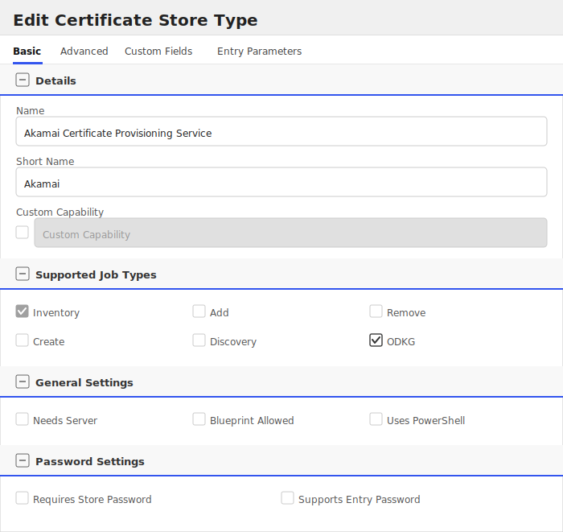

   ##### Advanced Tab
   | Attribute | Value | Description |
   | --------- | ----- | ----- |
   | Supports Custom Alias | Forbidden | Determines if an individual entry within a store can have a custom Alias. |
   | Private Key Handling | Forbidden | This determines if Keyfactor can send the private key associated with a certificate to the store. |
   | PFX Password Style | Default | 'Default' - PFX password is randomly generated, 'Custom' - PFX password may be specified when the enrollment job is created (Requires the Allow Custom Password application setting to be enabled.) |

   The Advanced tab should look like this:

   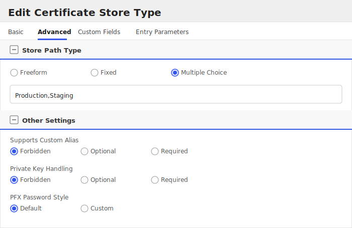

   > For Keyfactor **Command versions 24.4 and later**, a Certificate Format dropdown is available with PFX and PEM options. Ensure that **PFX** is selected, as this determines the format of new and renewed certificates sent to the Orchestrator during a Management job. Currently, all Keyfactor-supported Orchestrator extensions support only PFX.

   ##### Custom Fields Tab
   Custom fields operate at the certificate store level and are used to control how the orchestrator connects to the remote target server containing the certificate store to be managed. The following custom fields should be added to the store type:

   | Name | Display Name | Description | Type | Default Value/Options | Required |
   | ---- | ------------ | ---- | --------------------- | -------- | ----------- |
   | access_token | Access Token | The Akamai access_token for authentication. | Secret |  | ✅ Checked |
   | client_token | Client Token | The Akamai client_token for authentication. | Secret |  | ✅ Checked |
   | client_secret | Client Secret | The Akamai client_secret for authentication. | Secret |  | ✅ Checked |

   The Custom Fields tab should look like this:

   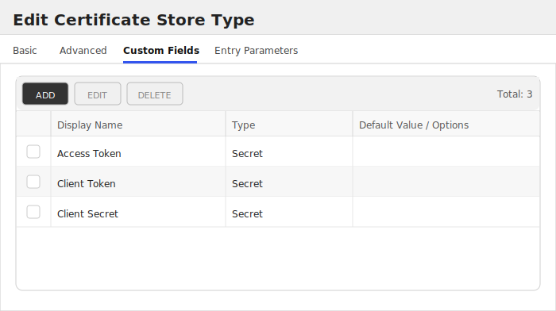

   ###### Access Token
   The Akamai access_token for authentication.

   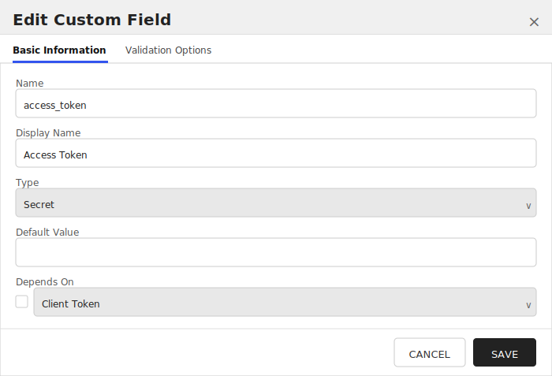
   


   ###### Client Token
   The Akamai client_token for authentication.

   
   


   ###### Client Secret
   The Akamai client_secret for authentication.

   
   


   ###### Access Token
   The Akamai access_token for authentication.

   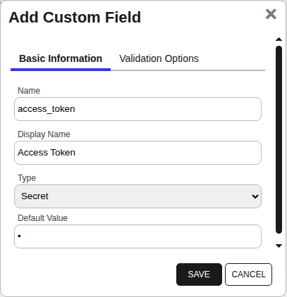
   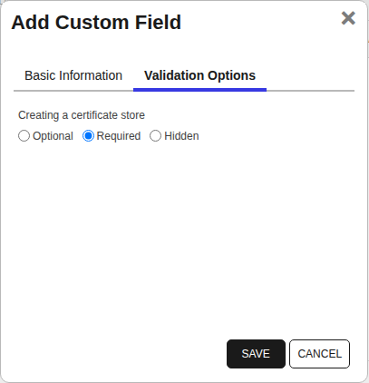


   ###### Client Token
   The Akamai client_token for authentication.

   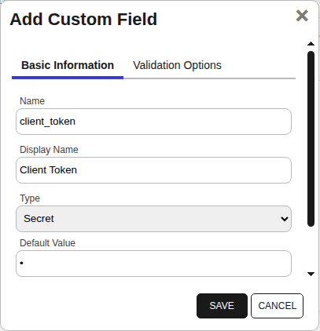
   


   ###### Client Secret
   The Akamai client_secret for authentication.

   
   


   ##### Entry Parameters Tab

   | Name | Display Name | Description | Type | Default Value | Entry has a private key | Adding an entry | Removing an entry | Reenrolling an entry |
   | ---- | ------------ | ---- | ------------- | ----------------------- | ---------------- | ----------------- | ------------------- | ----------- |
   | EnrollmentId | Enrollment ID | Enrollment ID of a certificate enrollment in Akamai. This should only be supplied for ODKG when replacing an existing certificate. | String |  | 🔲 Unchecked | 🔲 Unchecked | 🔲 Unchecked | 🔲 Unchecked |
   | ContractId | Contract ID | The Contract ID of your account in Akamai. | String | SET-DEFAULT | 🔲 Unchecked | 🔲 Unchecked | 🔲 Unchecked | ✅ Checked |
   | Sans | SANs | SANs for the new certificate. If multiple are supplied, they should be split with an ampersand character '&' | String |  | 🔲 Unchecked | 🔲 Unchecked | 🔲 Unchecked | ✅ Checked |
   | admin-addressLineOne | Admin - Address Line 1 | Required field for Administrator contact. | String | SET-DEFAULT | 🔲 Unchecked | 🔲 Unchecked | 🔲 Unchecked | ✅ Checked |
   | admin-addressLineTwo | Admin - Address Line 2 | Optional field for Administrator contact. | String |  | 🔲 Unchecked | 🔲 Unchecked | 🔲 Unchecked | 🔲 Unchecked |
   | admin-city | Admin - City | Required field for Administrator contact. | String | SET-DEFAULT | 🔲 Unchecked | 🔲 Unchecked | 🔲 Unchecked | ✅ Checked |
   | admin-country | Admin - Country | Required field for Administrator contact. | String | SET-DEFAULT | 🔲 Unchecked | 🔲 Unchecked | 🔲 Unchecked | ✅ Checked |
   | admin-email | Admin - Email | Required field for Administrator contact. | String | SET-DEFAULT | 🔲 Unchecked | 🔲 Unchecked | 🔲 Unchecked | ✅ Checked |
   | admin-firstName | Admin - First Name | Required field for Administrator contact. | String | SET-DEFAULT | 🔲 Unchecked | 🔲 Unchecked | 🔲 Unchecked | ✅ Checked |
   | admin-lastName | Admin - Last Name | Required field for Administrator contact. | String | SET-DEFAULT | 🔲 Unchecked | 🔲 Unchecked | 🔲 Unchecked | ✅ Checked |
   | admin-organizationName | Admin - Organization Name | Required field for Administrator contact. | String | SET-DEFAULT | 🔲 Unchecked | 🔲 Unchecked | 🔲 Unchecked | ✅ Checked |
   | admin-phone | Admin - Phone | Required field for Administrator contact. | String | SET-DEFAULT | 🔲 Unchecked | 🔲 Unchecked | 🔲 Unchecked | ✅ Checked |
   | admin-postalCode | Admin - Postal Code | Required field for Administrator contact. | String | SET-DEFAULT | 🔲 Unchecked | 🔲 Unchecked | 🔲 Unchecked | ✅ Checked |
   | admin-region | Admin - Region | Required field for Administrator contact. | String | SET-DEFAULT | 🔲 Unchecked | 🔲 Unchecked | 🔲 Unchecked | ✅ Checked |
   | admin-title | Admin - Title | Required field for Administrator contact. | String | SET-DEFAULT | 🔲 Unchecked | 🔲 Unchecked | 🔲 Unchecked | ✅ Checked |
   | org-addressLineOne | Org - Address Line 1 | Required field for Organization contact. | String | SET-DEFAULT | 🔲 Unchecked | 🔲 Unchecked | 🔲 Unchecked | ✅ Checked |
   | org-addressLineTwo | Org - Address Line 2 | Optional field for Organization contact. | String |  | 🔲 Unchecked | 🔲 Unchecked | 🔲 Unchecked | 🔲 Unchecked |
   | org-city | Org - City | Required field for Organization contact. | String | SET-DEFAULT | 🔲 Unchecked | 🔲 Unchecked | 🔲 Unchecked | ✅ Checked |
   | org-country | Org - Country | Required field for Organization contact. | String | SET-DEFAULT | 🔲 Unchecked | 🔲 Unchecked | 🔲 Unchecked | ✅ Checked |
   | org-organizationName | Org - Organization Name | Required field for Organization contact. | String | SET-DEFAULT | 🔲 Unchecked | 🔲 Unchecked | 🔲 Unchecked | ✅ Checked |
   | org-phone | Org - Phone | Required field for Organization contact. | String | SET-DEFAULT | 🔲 Unchecked | 🔲 Unchecked | 🔲 Unchecked | ✅ Checked |
   | org-postalCode | Org - Postal Code | Required field for Organization contact. | String | SET-DEFAULT | 🔲 Unchecked | 🔲 Unchecked | 🔲 Unchecked | ✅ Checked |
   | org-region | Org - Region | Required field for Organization contact. | String | SET-DEFAULT | 🔲 Unchecked | 🔲 Unchecked | 🔲 Unchecked | ✅ Checked |
   | tech-addressLineOne | Tech - Address Line 1 | Required field for Akamai Tech contact. | String | SET-DEFAULT | 🔲 Unchecked | 🔲 Unchecked | 🔲 Unchecked | ✅ Checked |
   | tech-addressLineTwo | Tech - Address Line 2 | Optional field for Akamai Tech contact. | String |  | 🔲 Unchecked | 🔲 Unchecked | 🔲 Unchecked | 🔲 Unchecked |
   | tech-city | Tech - City | Required field for Akamai Tech contact. | String | SET-DEFAULT | 🔲 Unchecked | 🔲 Unchecked | 🔲 Unchecked | ✅ Checked |
   | tech-country | Tech - Country | Required field for Akamai Tech contact. | String | SET-DEFAULT | 🔲 Unchecked | 🔲 Unchecked | 🔲 Unchecked | ✅ Checked |
   | tech-email | Tech - Email | Required field for Akamai Tech contact. Must be an akamai.com email address. | String | SET-DEFAULT | 🔲 Unchecked | 🔲 Unchecked | 🔲 Unchecked | ✅ Checked |
   | tech-firstName | Tech - First Name | Required field for Akamai Tech contact. | String | SET-DEFAULT | 🔲 Unchecked | 🔲 Unchecked | 🔲 Unchecked | ✅ Checked |
   | tech-lastName | Tech - Last Name | Required field for Akamai Tech contact. | String | SET-DEFAULT | 🔲 Unchecked | 🔲 Unchecked | 🔲 Unchecked | ✅ Checked |
   | tech-organizationName | Tech - Organization Name | Required field for Akamai Tech contact. | String | Akamai | 🔲 Unchecked | 🔲 Unchecked | 🔲 Unchecked | ✅ Checked |
   | tech-phone | Tech - Phone | Required field for Akamai Tech contact. | String | SET-DEFAULT | 🔲 Unchecked | 🔲 Unchecked | 🔲 Unchecked | ✅ Checked |
   | tech-postalCode | Tech - Postal Code | Required field for Akamai Tech contact. | String | SET-DEFAULT | 🔲 Unchecked | 🔲 Unchecked | 🔲 Unchecked | ✅ Checked |
   | tech-region | Tech - Region | Required field for Akamai Tech contact. | String | SET-DEFAULT | 🔲 Unchecked | 🔲 Unchecked | 🔲 Unchecked | ✅ Checked |
   | tech-title | Tech - Title | Required field for Akamai Tech contact. | String | SET-DEFAULT | 🔲 Unchecked | 🔲 Unchecked | 🔲 Unchecked | ✅ Checked |
   | deployment-network | Deployment Network | Required field for Deployment Network. | MultipleChoice | Standard TLS | 🔲 Unchecked | 🔲 Unchecked | 🔲 Unchecked | ✅ Checked |

   The Entry Parameters tab should look like this:

   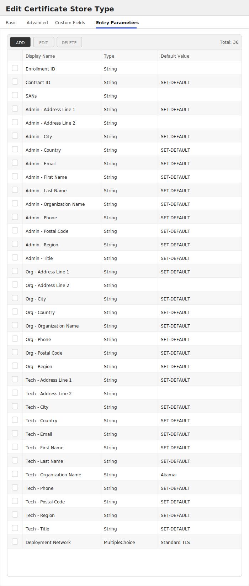
   ##### Enrollment ID
   Enrollment ID of a certificate enrollment in Akamai. This should only be supplied for ODKG when replacing an existing certificate.

   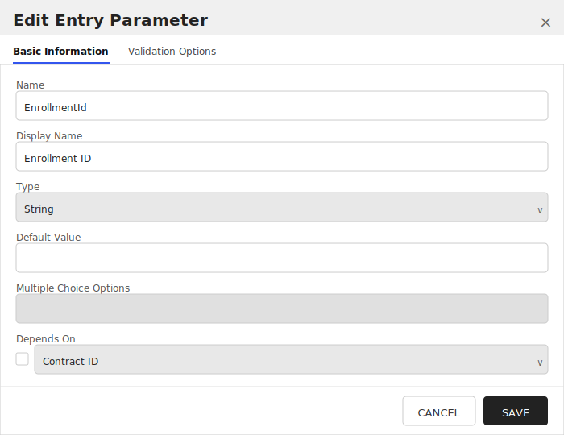
   


   ##### Contract ID
   The Contract ID of your account in Akamai.

   
   


   ##### SANs
   SANs for the new certificate. If multiple are supplied, they should be split with an ampersand character '&'

   
   


   ##### Admin - Address Line 1
   Required field for Administrator contact.

   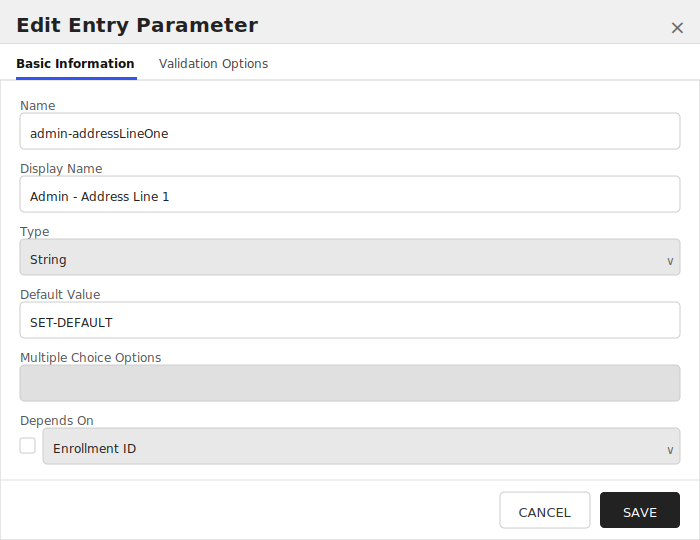
   


   ##### Admin - Address Line 2
   Optional field for Administrator contact.

   
   


   ##### Admin - City
   Required field for Administrator contact.

   
   


   ##### Admin - Country
   Required field for Administrator contact.

   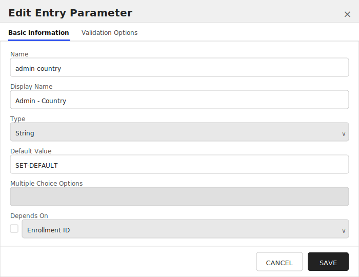
   


   ##### Admin - Email
   Required field for Administrator contact.

   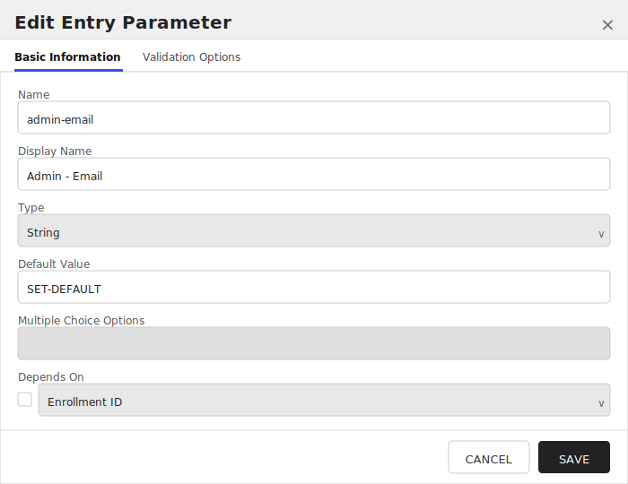
   


   ##### Admin - First Name
   Required field for Administrator contact.

   
   


   ##### Admin - Last Name
   Required field for Administrator contact.

   
   


   ##### Admin - Organization Name
   Required field for Administrator contact.

   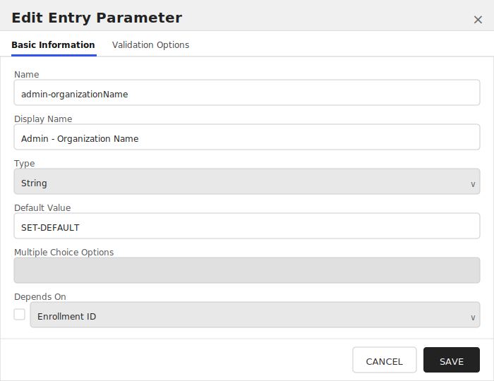
   


   ##### Admin - Phone
   Required field for Administrator contact.

   
   


   ##### Admin - Postal Code
   Required field for Administrator contact.

   
   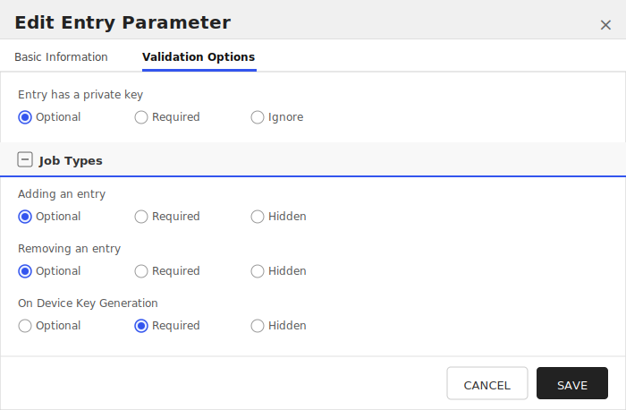


   ##### Admin - Region
   Required field for Administrator contact.

   
   


   ##### Admin - Title
   Required field for Administrator contact.

   
   


   ##### Org - Address Line 1
   Required field for Organization contact.

   
   


   ##### Org - Address Line 2
   Optional field for Organization contact.

   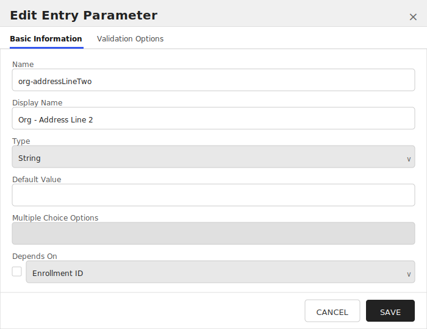
   


   ##### Org - City
   Required field for Organization contact.

   
   


   ##### Org - Country
   Required field for Organization contact.

   
   


   ##### Org - Organization Name
   Required field for Organization contact.

   
   


   ##### Org - Phone
   Required field for Organization contact.

   
   


   ##### Org - Postal Code
   Required field for Organization contact.

   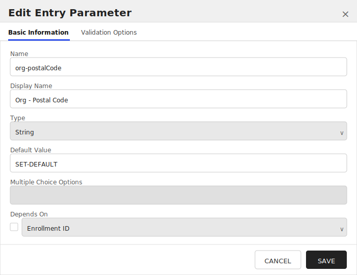
   


   ##### Org - Region
   Required field for Organization contact.

   
   


   ##### Tech - Address Line 1
   Required field for Akamai Tech contact.

   
   


   ##### Tech - Address Line 2
   Optional field for Akamai Tech contact.

   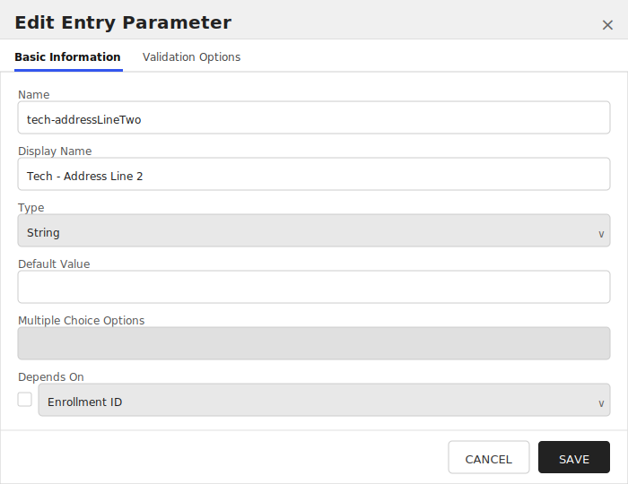
   


   ##### Tech - City
   Required field for Akamai Tech contact.

   
   


   ##### Tech - Country
   Required field for Akamai Tech contact.

   
   


   ##### Tech - Email
   Required field for Akamai Tech contact. Must be an akamai.com email address.

   
   


   ##### Tech - First Name
   Required field for Akamai Tech contact.

   
   


   ##### Tech - Last Name
   Required field for Akamai Tech contact.

   
   


   ##### Tech - Organization Name
   Required field for Akamai Tech contact.

   
   


   ##### Tech - Phone
   Required field for Akamai Tech contact.

   
   


   ##### Tech - Postal Code
   Required field for Akamai Tech contact.

   
   


   ##### Tech - Region
   Required field for Akamai Tech contact.

   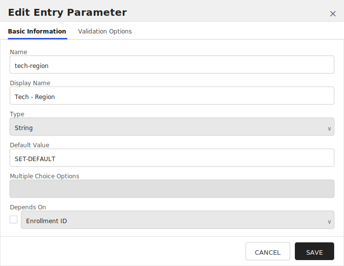
   


   ##### Tech - Title
   Required field for Akamai Tech contact.

   
   


   ##### Deployment Network
   Required field for Deployment Network.

   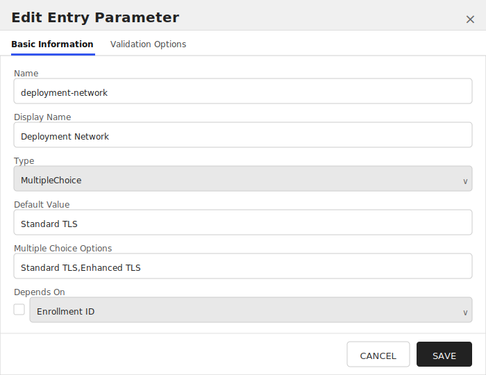
   


   ##### Enrollment ID
   Enrollment ID of a certificate enrollment in Akamai. This should only be supplied for ODKG when replacing an existing certificate.

   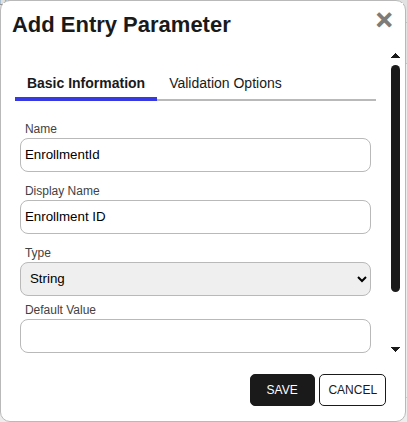
   


   ##### Contract ID
   The Contract ID of your account in Akamai.

   
   


   ##### SANs
   SANs for the new certificate. If multiple are supplied, they should be split with an ampersand character '&'

   
   


   ##### Admin - Address Line 1
   Required field for Administrator contact.

   
   


   ##### Admin - Address Line 2
   Optional field for Administrator contact.

   
   


   ##### Admin - City
   Required field for Administrator contact.

   
   


   ##### Admin - Country
   Required field for Administrator contact.

   
   


   ##### Admin - Email
   Required field for Administrator contact.

   
   


   ##### Admin - First Name
   Required field for Administrator contact.

   
   


   ##### Admin - Last Name
   Required field for Administrator contact.

   
   


   ##### Admin - Organization Name
   Required field for Administrator contact.

   
   


   ##### Admin - Phone
   Required field for Administrator contact.

   
   


   ##### Admin - Postal Code
   Required field for Administrator contact.

   
   


   ##### Admin - Region
   Required field for Administrator contact.

   
   


   ##### Admin - Title
   Required field for Administrator contact.

   
   


   ##### Org - Address Line 1
   Required field for Organization contact.

   
   


   ##### Org - Address Line 2
   Optional field for Organization contact.

   
   


   ##### Org - City
   Required field for Organization contact.

   
   


   ##### Org - Country
   Required field for Organization contact.

   
   


   ##### Org - Organization Name
   Required field for Organization contact.

   
   


   ##### Org - Phone
   Required field for Organization contact.

   
   


   ##### Org - Postal Code
   Required field for Organization contact.

   
   


   ##### Org - Region
   Required field for Organization contact.

   
   


   ##### Tech - Address Line 1
   Required field for Akamai Tech contact.

   
   


   ##### Tech - Address Line 2
   Optional field for Akamai Tech contact.

   
   


   ##### Tech - City
   Required field for Akamai Tech contact.

   
   


   ##### Tech - Country
   Required field for Akamai Tech contact.

   
   


   ##### Tech - Email
   Required field for Akamai Tech contact. Must be an akamai.com email address.

   
   


   ##### Tech - First Name
   Required field for Akamai Tech contact.

   
   


   ##### Tech - Last Name
   Required field for Akamai Tech contact.

   
   


   ##### Tech - Organization Name
   Required field for Akamai Tech contact.

   
   


   ##### Tech - Phone
   Required field for Akamai Tech contact.

   
   


   ##### Tech - Postal Code
   Required field for Akamai Tech contact.

   
   


   ##### Tech - Region
   Required field for Akamai Tech contact.

   
   


   ##### Tech - Title
   Required field for Akamai Tech contact.

   
   


   ##### Deployment Network
   Required field for Deployment Network.

   
   


   </details>

## Installation

1. **Download the latest Akamai Certificate Provisioning System (CPS) Universal Orchestrator extension from GitHub.**

    Navigate to the [Akamai Certificate Provisioning System (CPS) Universal Orchestrator extension GitHub version page](https://github.com/Keyfactor/akamai-cps-orchestrator/releases/latest). Refer to the compatibility matrix below to determine which asset should be downloaded. Then, click the corresponding asset to download the zip archive.

   | Universal Orchestrator Version | Latest .NET version installed on the Universal Orchestrator server | `rollForward` condition in `Orchestrator.runtimeconfig.json` | `akamai-cps-orchestrator` .NET version to download |
   | --------- | ----------- | ----------- | ----------- |
   | Between `11.0.0` and `11.5.1` (inclusive) | `net8.0` | `LatestMajor` | `net8.0` |
   | `11.6` _and_ newer | `net8.0` | | `net8.0` | 

    Unzip the archive containing extension assemblies to a known location.

    > **Note** If you don't see an asset with a corresponding .NET version, you should always assume that it was compiled for `net8.0`.

2. **Locate the Universal Orchestrator extensions directory.**

    * **Default on Windows** - `C:\Program Files\Keyfactor\Keyfactor Orchestrator\extensions`
    * **Default on Linux** - `/opt/keyfactor/orchestrator/extensions`

3. **Create a new directory for the Akamai Certificate Provisioning System (CPS) Universal Orchestrator extension inside the extensions directory.**

    Create a new directory called `akamai-cps-orchestrator`.
    > The directory name does not need to match any names used elsewhere; it just has to be unique within the extensions directory.

4. **Copy the contents of the downloaded and unzipped assemblies from __step 2__ to the `akamai-cps-orchestrator` directory.**

5. **Restart the Universal Orchestrator service.**

    Refer to [Starting/Restarting the Universal Orchestrator service](https://software.keyfactor.com/Core-OnPrem/Current/Content/InstallingAgents/NetCoreOrchestrator/StarttheService.htm).

6. **(optional) PAM Integration**

    The Akamai Certificate Provisioning System (CPS) Universal Orchestrator extension is compatible with all supported Keyfactor PAM extensions to resolve PAM-eligible secrets. PAM extensions running on Universal Orchestrators enable secure retrieval of secrets from a connected PAM provider.

    To configure a PAM provider, [reference the Keyfactor Integration Catalog](https://keyfactor.github.io/integrations-catalog/content/pam) to select an extension and follow the associated instructions to install it on the Universal Orchestrator (remote).

> The above installation steps can be supplemented by the [official Command documentation](https://software.keyfactor.com/Core-OnPrem/Current/Content/InstallingAgents/NetCoreOrchestrator/CustomExtensions.htm?Highlight=extensions).

## Defining Certificate Stores

### Store Creation

#### Manually with the Command UI

<details><summary>Click to expand details</summary>

1. **Navigate to the _Certificate Stores_ page in Keyfactor Command.**

    Log into Keyfactor Command, toggle the _Locations_ dropdown, and click _Certificate Stores_.

2. **Add a Certificate Store.**

    Click the Add button to add a new Certificate Store. Use the table below to populate the **Attributes** in the **Add** form.

   | Attribute | Description |
   | --------- | ----------- |
   | Category | Select "Akamai Certificate Provisioning Service" or the customized certificate store name from the previous step. |
   | Container | Optional container to associate certificate store with. |
   | Client Machine | The Client Machine field is the Akamai REST API URL. This should be equal to the "host" value from the API credentials file. |
   | Store Path | The Akamai network the certificate will be managed from. Value can be either "Production" or "Staging". |
   | Orchestrator | Select an approved orchestrator capable of managing `Akamai` certificates. Specifically, one with the `Akamai` capability. |
   | access_token | The Akamai access_token for authentication. |
   | client_token | The Akamai client_token for authentication. |
   | client_secret | The Akamai client_secret for authentication. |

</details>

#### Using kfutil CLI

<details><summary>Click to expand details</summary>

1. **Generate a CSV template for the Akamai certificate store**

    ```shell
    kfutil stores import generate-template --store-type-name Akamai --outpath Akamai.csv
    ```
2. **Populate the generated CSV file**

    Open the CSV file, and reference the table below to populate parameters for each **Attribute**.

   | Attribute | Description |
   | --------- | ----------- |
   | Category | Select "Akamai Certificate Provisioning Service" or the customized certificate store name from the previous step. |
   | Container | Optional container to associate certificate store with. |
   | Client Machine | The Client Machine field is the Akamai REST API URL. This should be equal to the "host" value from the API credentials file. |
   | Store Path | The Akamai network the certificate will be managed from. Value can be either "Production" or "Staging". |
   | Orchestrator | Select an approved orchestrator capable of managing `Akamai` certificates. Specifically, one with the `Akamai` capability. |
   | Properties.access_token | The Akamai access_token for authentication. |
   | Properties.client_token | The Akamai client_token for authentication. |
   | Properties.client_secret | The Akamai client_secret for authentication. |

3. **Import the CSV file to create the certificate stores**

    ```shell
    kfutil stores import csv --store-type-name Akamai --file Akamai.csv
    ```

</details>

#### PAM Provider Eligible Fields
<details><summary>Attributes eligible for retrieval by a PAM Provider on the Universal Orchestrator</summary>

If a PAM provider was installed _on the Universal Orchestrator_ in the [Installation](#Installation) section, the following parameters can be configured for retrieval _on the Universal Orchestrator_.

   | Attribute | Description |
   | --------- | ----------- |
   | access_token | The Akamai access_token for authentication. |
   | client_token | The Akamai client_token for authentication. |
   | client_secret | The Akamai client_secret for authentication. |

Please refer to the **Universal Orchestrator (remote)** usage section ([PAM providers on the Keyfactor Integration Catalog](https://keyfactor.github.io/integrations-catalog/content/pam)) for your selected PAM provider for instructions on how to load attributes orchestrator-side.
> Any secret can be rendered by a PAM provider _installed on the Keyfactor Command server_. The above parameters are specific to attributes that can be fetched by an installed PAM provider running on the Universal Orchestrator server itself.

</details>

> The content in this section can be supplemented by the [official Command documentation](https://software.keyfactor.com/Core-OnPrem/Current/Content/ReferenceGuide/Certificate%20Stores.htm?Highlight=certificate%20store).

### Extension Mechanics

Adding new certificates to Akamai requires generating a key in Akamai CPS via the Reenrollment process in Keyfactor. 
To start this process, go to the Certificate Store that the certificate should be added to. Select the certificate 
store, and click the `Reenrollment` / `OKDG` button to bring up the reenrollment dialog.

Change any `default` values as needed, and enter an `Enrollment ID` if an existing enrollment needs to be updated instead 
of creating a new Enrollment. This is different from the `Slot ID` - the `Enrollment ID` is found by clicking on an 
Active certificate in Akamai CPS, and looking at the `ID` value. The SAN entry needs to be filled out with the DNS value 
you are using for the certificate's CN. If there are multiple DNS SANs, they should be separated with an ampersand (`&`). 
Example: `www.example01.com&www.example02.com`

> [!IMPORTANT]
>
> This extension only supports `RSA` and `ECC` key algorithms. Please make sure the targeted enrollment pattern or certificate template supports these key algorithms.

#### Configure Renewal of Certificates using a Workflow
Akamai does not support traditional certificate Renewal or one-click Renewal done in the Keyfactor Command platform. 
The Renewal process creates Certificates with outside keys which are not allowed to be imported into Akamai CPS. As a 
result, the Reenrollment (ODKG) Job must be used in order to renew existing certificates that reside on the Akamai system. 
Reenrollment is required as opposed to the Renewal process as it allows Akamai to generate the keys on their platform, 
which are used to create a certificate in Keyfactor.

Renewing existing certificates in Akamai means running a Reenrollment Job with the same `Enrollment ID` that was used 
for an existing Certificate Enrollment. This can be done manually through the Reenrollment prompt, but an automated 
process can also be configured using a Keyfactor Workflow. The Workflow should be configured to target a Keyfactor 
Collection of certificates that includes the Akamai certificates that need to be renewed. This can be done with a query 
targeting the `CertStoreFQDN` containing `Akamai` and can be further restricted with the `CertStorePath` being equal to 
`Production` or `Staging`. A sample workflow for ODKG / Reenrollment scheduling for renewals can be viewed in the 
[kf-workflow-samples repo](https://github.com/Keyfactor/kf-workflow-samples). When running the sample workflow, it will 
assume that all certs passed to the script should schedule a Reenrollment job with their existing parameters in Akamai.

#### Deployment Network Configuration

When enrolling a certificate, you can now specify the `Deployment Network` of the certificate. The valid values are `Standard TLS` and `Enhanced TLS`. If not specified, `Standard TLS` will be used by default for backwards compatibility.

When performing a Reenrollment of an existing certificate, if the `Deployment Network` specified in the Reenrollment configuration is different from the existing enrollment's network type, the existing enrollment network will be preserved. Akamai does not support changing the network type of an existing enrollment. A warning message will be returned in this case to indicate that the network type could not be updated.

If the deployment network for an enrollment needs to be changed, a new enrollment must be created with the desired network type.

> [!NOTE]
>
> If the certificate store type was created before version 2.0.0 of the Akamai CPS Orchestrator, please either update the certificate store type from the UI or utilize [the job properties SQL script](akamai-cps-orchestrator/jobproperties.sql) to add the `Deployment Network` entry parameter to the store type.

#### Trust Chain Building

A new feature introduced in 2.0.0 of the Akamai CPS Orchestrator is the ability to build the trust chain of the enrolled certificate and add this to the Akamai trust chain for the certificate.

Currently, only the leaf certificate is returned from Keyfactor Command after enrolling a CSR, so the orchestrator will attempt to build the trust chain with two separate methods:
- Retrieving the intermediate and root certificates using the AIA information in the leaf certificate
- Searching the trust store of the system running the orchestrator for matching intermediate and root certificates (both must be found in order to build the chain)

If the trust chain cannot be built using either of these methods, the orchestrator will still complete the enrollment, but a warning message will be returned indicating that the trust chain could not be built. Please ensure that the intermediate and root certificates are part of your system's trust store or have publicly available AIA information to allow the orchestrator to build the trust chain successfully.


## Use Cases

The Akamai CPS orchestrator extension implements the following capabilities:
1. Inventory - Return all certificates of the type defined in the cert store (Production or Staging)
2. Reenrollment - Process a key generation request and create a new certificate with a Keyfactor CA. Two scenarios are supported:
    1. No Enrollment Id provided - create a new Enrollment and certificate in Akamai
    2. Existing Enrollment Id provided - renew an existing certificate in Akamai and update the Enrollment

## License

Apache License 2.0, see [LICENSE](LICENSE).

## Related Integrations

See all [Keyfactor Universal Orchestrator extensions](https://github.com/orgs/Keyfactor/repositories?q=orchestrator).
