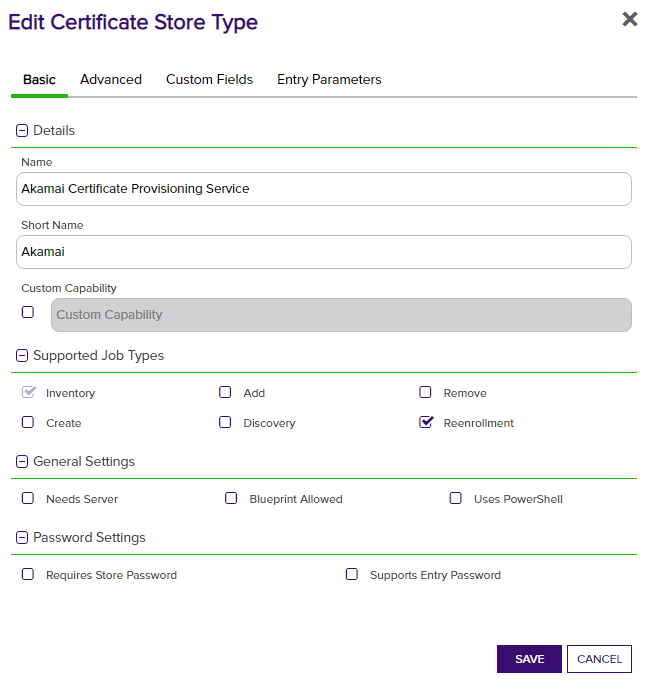
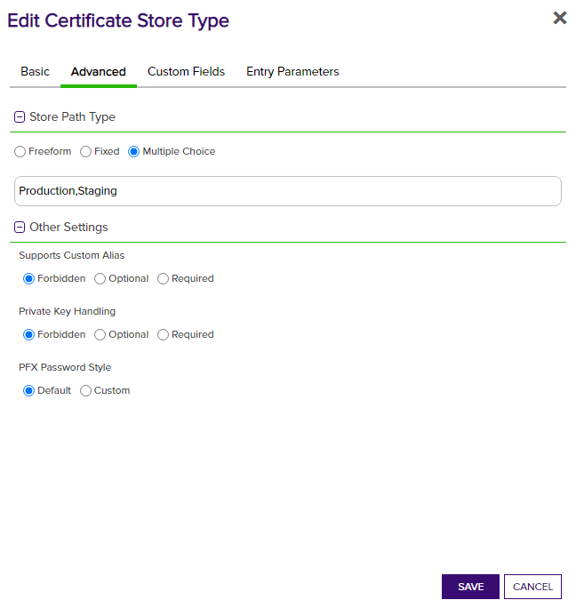

## Use Cases

The Akamai CPS orchestrator extension implements the following capabilities:
1. Inventory - Return all certificates of the type defined in the cert store (Production or Staging)
2. Reenrollment - Process a key generation request and create a new certificate with a Keyfactor CA. Two scenarios are supported:
    1. No Enrollment Id provided - create a new Enrollment and certificate in Akamai
    2. Existing Enrollment Id provided - renew an existing certificate in Akamai and update the Enrollment

## Keyfactor Version Supported

The Akamai CPS orchestrator extension has requires a Keyfactor Platform version of 9.10 or greater to support encrypted certificate store parameters for authentication.

## Akamai Platform Configuration

In the Akamai instance, an API Credential needs to be configured and used to provide authentication for the Keyfactor Orchestrator extension to function. To do this, navigate to `Account Admin` -> `Identity & access`. Clicking `Create API client`, select a user whose permissions should be used to access and manage certificates. This user should already have the needed permissions to access CPS. The access of the API Client can be restricted to just the CPS APIs, but the API Client should have `READ-WRITE` access.

With the API Client created, a new credential should be generated by clicking `Create credential`. The contents of the credential should be downloaded or saved temporarily to use for configuring the Keyfactor Certificate Store. Afterwards, it should be deleted as the credential file serves as authentication for accessing APIs, and should be treated as a plaintext password and not saved long-term.

## Akamai Orchestrator Extension Configuration

**1. Create the New Certificate Store Type for the Akamai orchestrator extension**

In Keyfactor Command create a new Certificate Store Type similar to the one below by clicking Settings (the gear icon in the top right) => Certificate Store Types => Add:

Custom fields and entry parameters will be added after the store is created. This is required as there are many entry parameters.

**2. Add Custom Fields and Entry Paramaters**

To add the needed Custom Fields and Entry Parameters, [run the script](akamai-cps-orchestrator/jobproperties.sql) on the Keyfactor database to generate all the fields and parameters needed.

**3. Set default values of Entry Parameters**

The Entry Parameters are used during Enrollment creation in Akamai CPS to provide contact information and associate new certificates with the correct Contract in Akamai. After adding the parameters, re-open the Certificate Store Type configuration and set the default values.

The Contract ID should be set to the default contract to be used for new Enrollments. All of the address information should be filled out with default expected values, as they are required fields for **each** enrollment created and should not be entered manually unless they need to be overwritten for a specific Enrollment in Akamai.
The Tech contact information should be your Akamai company contact, and needs to have an Akamai email address and should have Akamai as the organization name.

**4. Create a new Akamai Certificate Store**

After the Certificate Store Type has been configured, a new Akamai Certificate Store can be created. When creating the store, the credentials generated in the Akamai platform for the API Client will be used.

| Certificate Store parameter | Akamai credential value |
|-|-|
| Client Machine | `host` |
| Access Token | `access_token` |
| Client Token | `client_token` |
| Client Secret | `client_secret` |

**5. (Optional) Enroll a new certificate in Akamai**

Adding new certificates to Akamai requires generating a key in Akamai CPS via the Reenrollment process in Keyfactor. To start this process, go to the Certificate Store that the certicate should be added to. Select the certificate store, and click the `Reenrollment` button to bring up the reenrollment dialog.

Change any default values as needed, and enter an Enrollment ID if an existing enrollment needs to be updated instead of creating a new Enrollment. This is different from the Slot ID - the Enrollment ID is found by clicking on an Active certificate in Akamai CPS, and looking at the `ID` value.
The SAN entry needs to be filled out with the DNS value you are using for the certificate's CN. If there are multiple DNS SANs, they should be separted with an ampersand. Example: `www.example01.com&www.example02.com`
